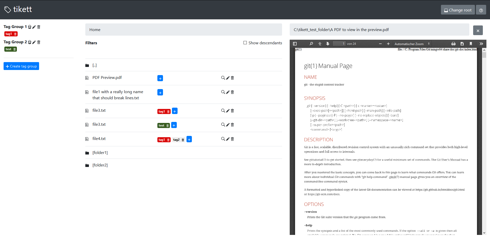

# tikett

tikett is an offline file tagging software that allows you to manage and tag files.

## Installation

- Download the latest [Release](https://github.com/flopes89/tikett/releases) and unzip it in a location
of your choosing.
- Download and install the latest [nodejs](https://nodejs.org) Release for your system
- Navigate to the unzipped `tikett` files (on command line)
- Execute `node server.js`

## Focus

It operates entirely offline (but can, being a client/server application) also be used on a private server. This makes
it ideal for sensitive documents, like scanned invoices, contracts or banking documents. No data will leave your
computer/server.

A key design principle is that tikett tries to be as future-proof as possible. This means that the tags are not
saved in any proprietary database, but instead written *directly into the files* (more specifically, the filenames)
of the files you tag.

So, a file named `2020-01-01_invoice.pdf` tagged with `Invoice` and `VISA` will be renamed by tikett to
`2020-01-01_invoice[Invoice VISA].pdf`. This is to make sure that documents can be searched and filtered with
even the most primitive of file systems.

You can use tikett once to tag all your files and then never use it again. All you will lose is the tag library and
convenience of a sleak user interface. Other than that, you can archive your files and still have all the benefits
of a fully tagged document library.

tikett is focussed on document libraries, specifically PDFs or text files, but you can tag any file type you want. Only
the file preview will be limited to what your browser can handle.

### Customization

The following environment variables can be used to customize the behaviour of tikett:

- `LOGLEVEL`: (default: "info") minimum log level to show when running. Useful for debugging weird behaviours
- `DBPATH`: (default: current working directory) overwrite the path where to save/load the `tikett.json` database file

## Developing

- Install dependencies and run the `dev` script
